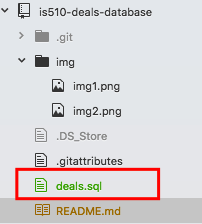
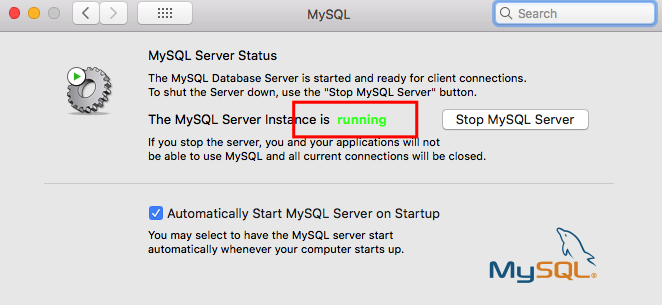

# Deals DB

## Overview
This multipart project is designed to provide practice with software tools and languages. Each short assignment applies what you have learned in the classroom that week. __Do not do assignments until they are assigned. They may change at any time until they are formally assigned.__

__You are encouraged to collaborate with your peers.__ However, you are also responsible for learning the key lessons of each assignment. So, if you need help, ask for it and pay attention to the answers. If you know how to help someone (without doing the work for them), then please help them out.

## Part 1: Systems Check
### Theory: You should know ...
* The purpose and use of each package in your software toolbox
* How the tools fit together into one seamless development environment

### Practice: You be able to ...
* Use the software we installed for this class
* Verify that the software is working correctly and debug if needed

### Instructions
__If any of the steps below fail, then ask for help. Often your best help will come from fellow students.__
1. __Use GitHub Classroom to create your own fork of this repository.__ GitHub Classroom should send you an invitation email. If not then just click this invitation link. Follow instructions provided by GitHub to link your account to this classroom.
2. __Clone the repository to your desktop.__ Click the `Clone or Download` link for your forked copy and then select `Open in Desktop`.  
  
*You will be asked to save the repository to your hard drive. Please select the IS510 folder you created in class.*
3. __Open the repository as a project in Atom.__ Right-click on the repository name in the repository selector and click `Open in Atom`. Atom should open the repository as a project.  

4. __Open the `deals.sql` file.__ Double-click the filename in the Atom project browser.  
  
The file should open in the editor window.  
*Take a moment to read the file. You will find comments used to explain each section, including a header comment at the top of the file stating the purpose of the file.*
5. __Start MySQL Server.__ How to do this depends on your operating system. The MacOS version is shown below.  
  
If all else fails, then RTFM for your version of MySQL and operating system.
6. __Use MySQL Workbench connect to MySQL Server.__ Select the running MySQL instance (usually on port 3306).

7. __Create the `deals` database from source.__ Use the File menu to open the `deals.sql` script from your repository (shown in the editor window below). Then run the SQL code by clicking the lightening bolt icon (see below).  The 'deals' database should appear in the Schemas panel to the left of the MySQL Workbench screen.  
  
8. __Open the `Deals_Part1.ipynb` notebook.__ From Anaconda Navigator's `Home` screen, launch Jupyter Notebook. Navigate to the `Deals_Part1.ipynb` file (in this folder). Click the file to open it.  

9. __Take a moment to inspect the code cells.__ The cells contain SQL queries embedded in code cells to extract data from our database as Pandas DataFrames.    

10. __Run the notebook to confirm that everything works.__ You can run the cells one at a time or all at once. You should get two identical listings of companies, one using SQL Alchemy and another using %sql magic.  

11. __Sign your name with new a Markdown cell at the bottom of the notebook.__ You can add new cells with the '+' button at the top of the notebook.  

12. __Commit and push your work to GitHub.__ In GitHub Desktop commit your changes to the notebook file using the comment 'Completed system check'. Then push (sync) the changes to GitHub. Refresh your web browser to be sure that GitHub accepted your changes.  

