# Deals DB

## Overview
This multipart project is designed to provide practice with software tools and languages. Each short assignment applies what you have learned in the classroom that week. __Do not do assignments until they are assigned. They may change at any time until they are formally assigned.__

__You are encouraged to collaborate with your peers.__ However, you are also responsible for learning the key lessons of each assignment. So, if you need help, ask for it and pay attention to the answers. If you know how to help someone (without doing the work for them), then please help them out.

## Part 1: Systems Check
### Theory: You should know ...
* The purpose and use of each package in your software toolbox
* How the tools fit together into one seamless development environment

### Practice: You be able to ...
* Use the software we installed for this class
* Verify that the software is working correctly and debug if needed

### Instructions
__If any of the steps below fail, then ask for help. Often your best help will come from fellow students.__
1. __Use GitHub Classroom to create your own fork of this repository.__  
GitHub Classroom should send you an invitation email. If not then just click this invitation link. Follow instructions provided by GitHub to link your account to this classroom.
2. __Clone the repository to your desktop.__  
Click the `Clone or Download` link for your forked copy and then select `Open in Desktop`.  
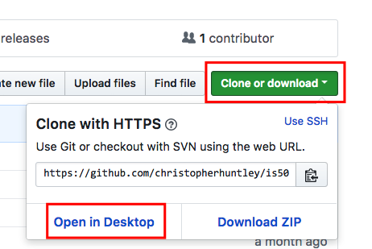  
*You will be asked to save the repository to your hard drive. Please select the IS510 folder you created in class.*
3. __Open the repository as a project in Atom.__  
Right-click on the repository name in the repository selector and click `Open in Atom`. Atom should open the repository as a project.  
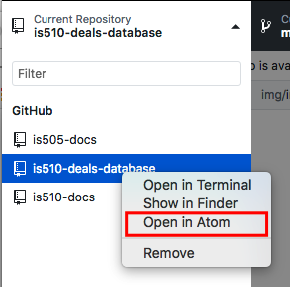  
4. __Open the `deals.sql` file.__  
Double-click the filename in the Atom project browser.  
  
The file should open in the editor window.  
*Take a moment to read the file. You will find comments used to explain each section, including a header comment at the top of the file stating the purpose of the file.*
5. __Start MySQL Server.__  
How to do this depends on your operating system. The MacOS version is shown below.  
  
If all else fails, then RTFM for your version of MySQL and operating system.
6. __Use MySQL Workbench connect to MySQL Server.__  
Select the running MySQL instance (usually on port 3306).
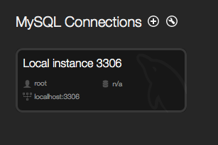  
7. __Create the `deals` database from source.__  
Use the File menu to open the `deals.sql` script from your repository (shown in the editor window below). Then run the SQL code by clicking the lightening bolt icon (see below).  The 'deals' database should appear in the Schemas panel to the left of the MySQL Workbench screen.  
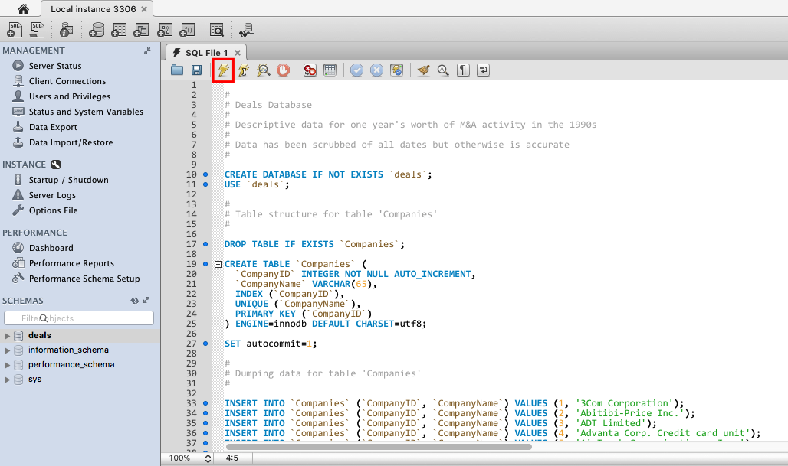  
8. __Open the `Deals_Part1.ipynb` notebook.__  
From Anaconda Navigator's `Home` screen, launch Jupyter Notebook. Navigate to the `Deals_Part1.ipynb` file (in this folder). Click the file to open it.  

9. __Take a moment to inspect the code cells.__  
The cells contain SQL queries to extract data from our database and display it all with Pandas DataFrames.    
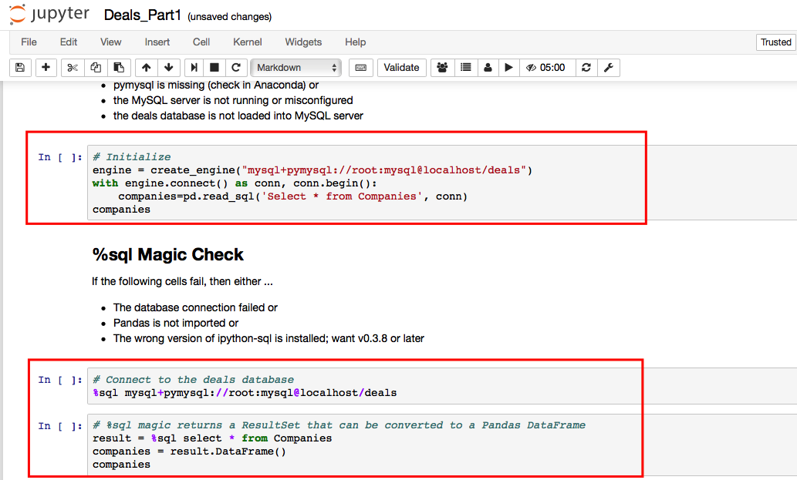
10. __Run the notebook to confirm that everything works.__  
You can run the cells one at a time or all at once. You should get two identical listings of companies, one using SQL Alchemy and another using %sql magic.  
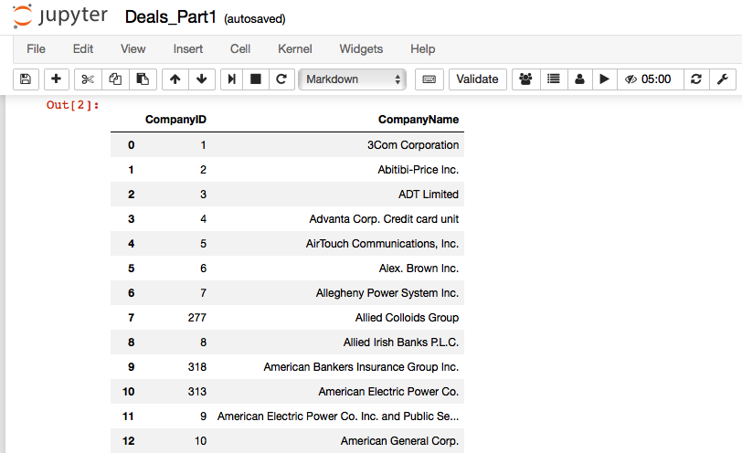
11. __Sign your name with new a Markdown cell at the bottom of the notebook.__  
You can add new cells with the '+' button at the top of the notebook.  
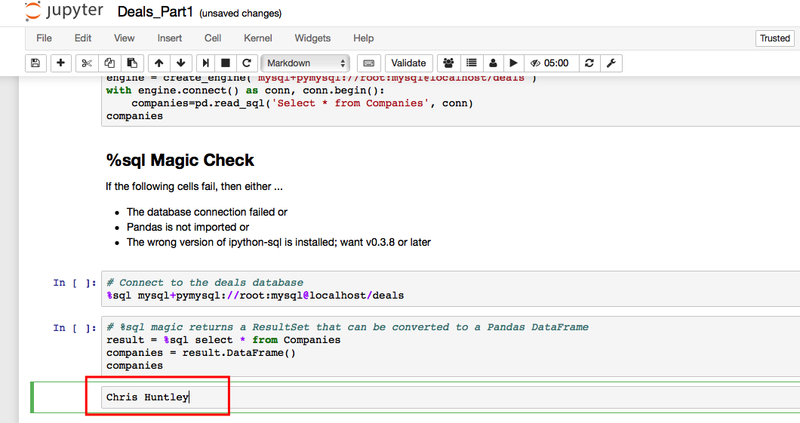
12. __Commit and push your work to GitHub.__  
In GitHub Desktop commit your changes to the notebook file using the comment 'Completed Part 1'. Then push (sync) the changes to GitHub. Refresh your web browser to be sure that GitHub accepted your changes.  
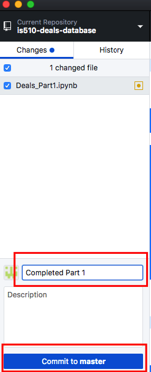
  

**Do not continue to Part 2 until you are told to do so.**

## Part 2: Select Queries
### Theory: You should know ...
* The common forms for SQL SELECT queries
* Each of the possible SQL SELECT clauses (in the correct order)
* How WHERE clauses and JOIN ... ON (...) expressions can be used to extract data from multiple tables
* How to call SQL functions in the SELECT, FROM, and WHERE clauses
* How to aggregate results into groups of records (with group-wise stats, etc.)
* How to create a callable View from a SQL Query

### Practice: You be able to ...
* Write SQL select queries within MySQL Workbench
* Debug queries based on i) errors reported by the interpreter and ii) your understanding of the source data

### Instructions
1. __Use MySQL Workbench to check that the server is running.__  
Open MySQL Workbench. Then select Server --> Server Status from the menus. If the server is not running then start it using whatever method you used in Part 1. *While you a here, close any editor tabs left open from Part 1.*  
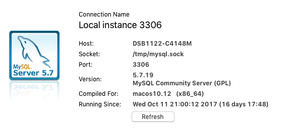
2. __Run a test query in Workbench.__  
Enter the following into the open editor tab and then run it (with the lightning bolt):
```SQL
# Indicate that we are using the deals database
USE deals;  
# Execute a test query  
SELECT *
FROM Companies
WHERE CompanyName like "%Inc."
```
You should get a listing of companies that whose names end with "Inc."
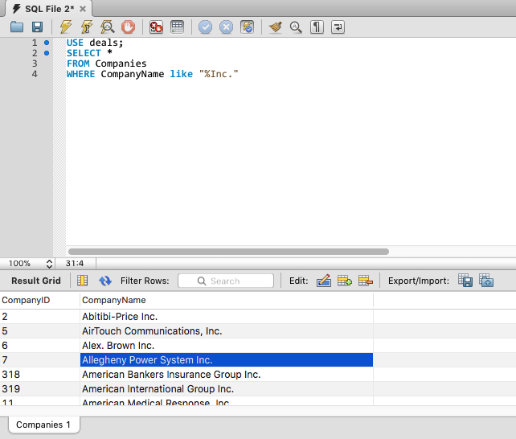  
3. __Add a new query to the bottom of the script that sorts companies by `CompanyID`.__  
The code looks like this:
```
# Select companies sorted by CompanyName
SELECT *
FROM Companies
ORDER BY CompanyID
```
Run it. To run just the current statement, use the lightning bolt with the I on it. You will get an error message in the Action Output panel.   
  
4. __Debug the SQL Error.__  
The error message pretty cryptic. What does `Error Code: 1064` mean? It's a syntax error. Can you spot the bug in the code? In this case it's pretty subtle: we are missing a semi-colon (`;`) at the end of each SELECT statement. Add the missing semi-colons and rerun:  
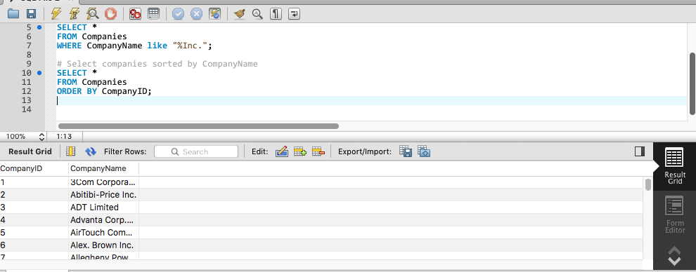  
5. __Use a where clause to merge data from multiple tables using the `WHERE` clause.__  
Now let's add another query, this time with data from the Deal tables DealParts. We'll do it one clause at a time. In the `SELECT` clause list the `DealName`,`PartNumber`, and `DollarValue` columns. In the `FROM` clause list the `Deal` and `DealPart` tables. In the `WHERE` clause specify that `Deals.DealID = DealParts.DealID`.  
  
Note that MySQL Workbench provides autocomplete support for column and table names. That helps a lot with avoiding typos.
6. __Repeat the multi-table query but using `JOIN ON` instead of `WHERE` to match records in the two tables.__  
This time we can omit the `WHERE` clause entirely.  
   
7. __Study the database schema to see more opportunities to join table.__  
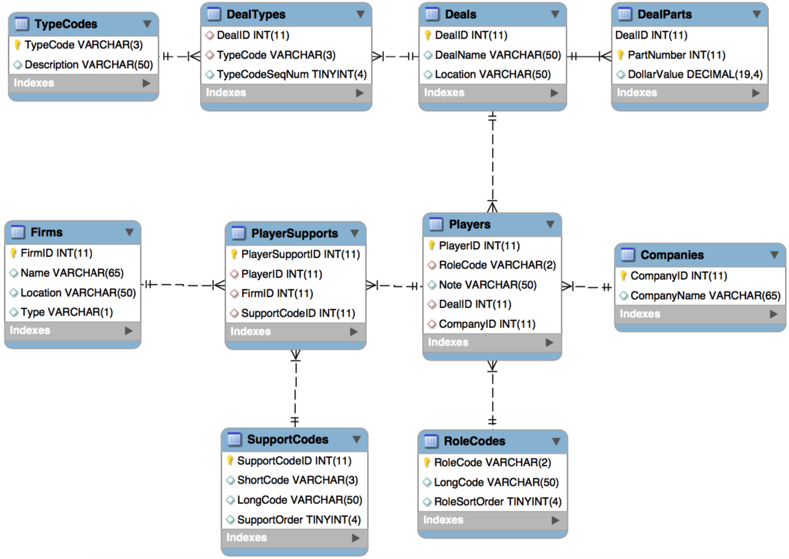  
Each line connecting the tables indicates a potential join. Sometimes you will need to use multiple joins per query if two tables are not directly connected. For example, to list each company involved in each deal, we need two 'chained' joins like this:  
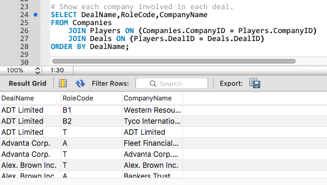    
The first join matches each company record to a player record. The second join matches each player record to a deal record.  
8. __Create a reusable view based on the previous select query.__  
For complex queries with multiple joins, extensive logic in the where clauses, etc., it can be handy to create a runnable version of the query that can be called as needed. Add this to your script to create the new view:
```
# Create a view that matches companies to deals
CREATE View CompanyDeals AS
SELECT DealName,RoleCode,CompanyName
FROM Companies
	JOIN Players ON (Companies.CompanyID = Players.CompanyID)
	JOIN Deals ON (Players.DealID = Deals.DealID)
ORDER BY DealName;
```
The view acts as a virtual table that can be used anywhere a table name can be used. To see how this works add a SELECT query that selects all rows and columns from the new `CompanyDeals` view:
```
# A test of the CompanyDeals view
SELECT * FROM CompanyDeals;
```  
9. __Create a view named `DealValues` that lists the DealID, total dollar value and number of parts for each deal.__  
Don't forget to use your database schema map when planning out your joins. Also, be sure to include a comment (above the code) indicating what the view is intended to do. Also include a select query to demonstrate that the view works correctly.
10. __Create a view named `DealSummary` that lists the DealID, DealName, number of players, total dollar value, and number of parts for each deal.__  
Bonus: use a subquery to construct a comma-separated list of deal types for each deal. (Don't forget the comment and the select query.)
11. __Create a view called `DealsByType` that lists TypeCode, number of deals, and total value of deals for each deal type.__  
Each deal type should be listed, even if there are no deals of that type. (Don't forget the comment and the select query.)
12. __Create a view called `DealPlayers` that lists the CompanyID, Name, and Role Code for each deal. Sort the players by the RoleSortOrder.__  
Bonus: use a subquery to list the kinds of support provided to each player by each firm. (Don't forget the comment and the select query.)
13. __Create a view called `DealsByFirm` that lists the FirmID, Name, number of deals, and total value of deals for each firm.__  
Each firm should be listed, even if there are no deals for that firm. (Don't forget the comment and the select query.)
14. __Save your script.__  
Name the file `DealsPart2.sql`. It should be saved in the repository folder.
15. __Sign your work.__  
At the top of the script, add a comment that sates the purpose of the script, your name and the date.
16. __Commit and sync to GitHub.__  
Use the Git comment 'Completed Part 2' and push to GitHub.

**Do not continue to Part 3 until you are told to do so.**

## Part 3: Foreign Keys
### Theory: You should know ...
* The syntax for indicating adding foreign key indexes to existing tables
* The performance implications of using foreign key constraints

### Practice: You be able to ...
* Write SQL to add foreign keys to tables
* Read an ERD to determine the required foreign keys

### Instructions
1. __Confirm that the database is loaded and running.__  
The steps are the same as before.
2. __In MySQL Workbench, create a new script called `DealsPart3.sql` in the repository folder.__  
At the top of the script add a header comment indicating what it does and signing your work.
3. __Add foreign keys to each table as indicated by the ERD in part 2.__  
Fortunately, the FK columns already exist. We just have to mark them as FKs. Use the following template for each FK constraint:
    ```
    ALTER TABLE `tablename`  
      ADD FOREIGN KEY (`fk-column`)
        REFERENCES `fk-tablename` (`fk-table-pk`);
    ```  
    where `tablename`,`fk-column`, etc. are replaced with the particulars for the relationship. *Note that the new FK constraints will make our queries run faster but are not strictly needed for SQL joins to work. They can also, however, increase the memory used by the DBMS, so there may actually be rare cases where FK constraints are best left undefined.*
4. __Commit and sync to GitHub.__  
Don't forget to save your script. Use the Git comment 'Completed Part 3' and push to GitHub.
